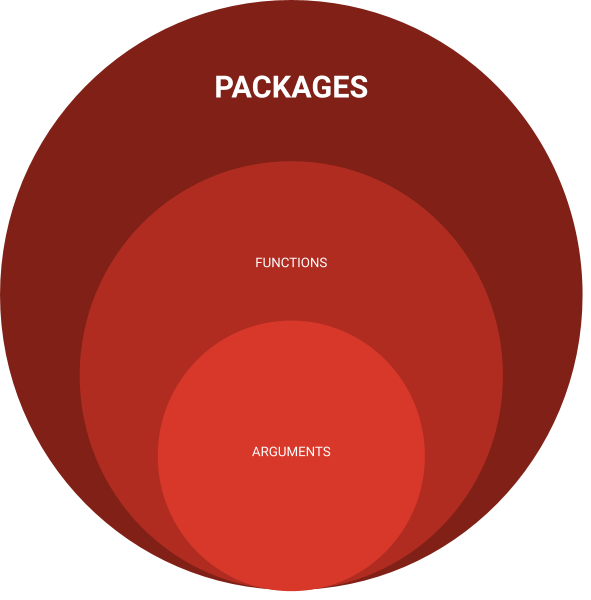

class: clear, title-slide, inverse, center, top, middle

```{r setup, include=FALSE}
knitr::opts_chunk$set(echo = FALSE)
```

```{r, echo=FALSE}
# then load all the relevant packages
pacman::p_load(pacman, knitr)
```

```{r xaringan-panelset, echo=FALSE}
xaringanExtra::use_panelset()
```

```{r xaringanExtra-clipboard, echo=FALSE}
# these allow any code snippets to be copied to the clipboard so they 
# can be pasted easily
htmltools::tagList(
  xaringanExtra::use_clipboard(
    button_text = "<i class=\"fa fa-clipboard\"></i>",
    success_text = "<i class=\"fa fa-check\" style=\"color: #90BE6D\"></i>",
  ),
  rmarkdown::html_dependency_font_awesome()
)
```
```{r xaringan-extras, echo=FALSE}
xaringanExtra::use_tile_view()

```

# `r rmarkdown::metadata$title`
----
### `r rmarkdown::metadata$author`
### `r format(Sys.time(), "%B %d, %Y")`

---
# Agenda

.pull-left[**Conceptual Overview**
- Open-Science 
- What is Reproducible Research? 
- Core Practices (Processes of RR) 
- Examples in LA of RR 
]

.pull-right[ **Code-Along**
- IDE “Scavenger Hunt” (Partner Activity)
- Highlighting Code Elements (Partner Activity)
- Style Editor
- Get Coding

]
*Optional: RR Checklist for Your Research*

---

class: clear, inverse, middle, center

PART 1:

----

Conceptual Overview

---
# Open Source, Open Science

.panelset[

.panel[.panel-name[Open Science]

**Open Science - "WHY?"**
.center[


]

???
- Promotes a more accurate verification of scientific results. 
- Speeds up scientific inquiry and discovery 
- Reduces duplication in collecting, creating, transferring, and re-using scientific material.
- Increases efficient use of financial resources.
- Results in innovation and increased consumer choice from public research.
- Promotes citizens’ engagement and trust in science. 

]

.panel[.panel-name[What]
.pull-left[
The [OECD](https://tinyurl.com/oecdlib) directorate for Science, Technology and Innovation (STI) leads OECD research on the contribution of science, technology and industry to well-being and economic growth.
]

.pull-right[

]
]
???
This framework incorporates access to data and information, as well as civil society engagement, in the different stages of the scientific research process. 

It is not meant to be prescriptive but should help different communities to decide on their own priorities within the open science space and to better visualize how these priorities link to different stage of the scientific process and to different actors. 

Such a framework can be useful also in considering how best to incentive's and measure different aspects of open science.

.panel[.panel-name[Discussion]

"Open Science policies encourage researchers to disclose a wide range of outputs from their work, thereby codifying openness as a specific set of research practices and guidelines that can be interpreted and applied consistently across disciplines and geographical settings." (Levin, N., & Leonelli, S. (2017). 

How do you "open" science in your practice?

*How does one “open” science? Questions of value in biological research. Science, Technology, & Human Values, 42(2), 280-305.)* 


]

]


---
class: clear, laser

.quote[Research findings cannot even really be considered “genuine contributions to human knowledge” until they have been verified through replication.]

.author[~ Stodden, 2009b, 38]

???

Piekert et al. exclaims that computational reproducibility is the ability to obtain identical results from the **same data** with the **same computer code**

---
# Reproducible Research

.panelset[

.panel[.panel-name[Why?]

.center[

]


]

???
Reproducibility is integral for empirical results. 

Reproducible Research has shown to 
Increase:
- Study replication
- Cumulative knowledge development
- Work habits 
- Teamwork
- Ease of revision to a project/study
- Higher impact research

Reduces:
- Effort duplication

Even with open science advancements projects fail to be reproduced by other researchers due to software dependencies, ambiguous documentation of exact computational steps, copy and paste errors and poor best practices.

.panel[.panel-name[What?]

**Core Practices**

“The **communication** aspect **should not be an afterthought**, it should be recorded with your analysis as you are going through it.” (-Harrison et al, 2020)
.center[

]
]

???

Well-documented research
- ReadMe file
- Use of code books - (variables, qual codes defined)
- Validation procedures
- Inclusion criteria 
- Research questions
- Considering including rough abstract
Clear communication
- Explanatory headers for source code files
- Code is well commented (#)
- Plain language
- Rationale for using functions and methods 
“Reproducible Theory”
- Foundation works and proofs cited appropriately

.panel[.panel-name[Discussion]

What have your experiences been with Reproducible Research?

]

.panel[.panel-name[Workflow]

.center[

]
]

???
Piekert et al. 2021 and Gandrud 2020 suggest following a Workflow for reproducibility to achieve long-term and cross-platform computational reproducibility of data analysis.
Piekert et al.s workflow includes 
1. Version control
2. Dynamic document generating
3. Dependency Tracking
4. Software management

while Gandrud's includes

]


---

class: clear, inverse, middle, center

Part 2:

----

Code-Along

---

.panelset[

.panel[.panel-name[R Environment]

.center[

]

]
???
**What is the Integrated Development Environment (IDE)?**
The IDE four main areas
- Console (& Terminal)
- Scripting and Viewing Window
- Files/Plots/Packages/Help
- Environment (& Connections/Git)

**CONSOLE:**
The console will show you what items have been run and any errors
The terminal provides access to the system shell. You can run scripts here

***Scripting and Viewing:**
The Script Window is the place to enter and run your code so that it is easily edited and saved for future use.
Two ways to execute your code in the R script, you can either highlight the code and click on Run, or you can highlight the code and press CTRL + Enter on your keyboard.

**Environment Window:**
The Environment tab allows you to see what objects are in the work space.
The history tab allows you to see the commands that you have entered.

.panel[.panel-name[Global Options]

.center[

]
]

.panel[.panel-name[New Script]
.center[

]

]


]
???


**Global options:**
customize the IDE to better suite your workflow
- wrap code
- change color scheme
- move panes around
- so much more

]
]
???

Let's set up our Global Options for a smooth workflow
- In the menu bar click `Tools` then `Global Options.`
    + 1. `R General` -> (untick) Restore .RData into workspace at startup.
    + 2. `R General` -> Save workspace to .RData on exit: Never
    + 3. `R Markdown` -> Show output preview in: Viewer Pane
]
---
#Packages

.panelset[

.panel[.panel-name[Packages]

.center[

]

]
???
There are about eight packages supplied with the R distribution and many more are available through the CRAN family of Internet sites covering a very wide range of modern statistics, and machine learning. If you need r to do something then there's probably a package for that.

.panel[.panel-name[install]

- 1st  Install tidyverse always use quotations for install
install.packages("tidyverse")

```{r install-code, echo=TRUE}


# read in tidyverse, do not need quotations reading into script
library(tidyverse) #<<
```


]

]

---
# Showing Your Code
```{r example-code, echo=TRUE}
# adding #<< after a line of code highlights it like this 
alphabet <- letters #<<
print(alphabet)
```


---
class: inverse, clear, center

## .font130[.center[**Thank you!**]]

.left-col[
.center[<br/>**First Author**<br/><mailto:author1@email.com>]
]
.center-col[
.center[<br/>**Second Author**<br/><mailto:author2@email.com>]
]
.right-col[
.center[<br/>**Third Author**<br/><mailto:author3@email.com>]
]
<br/><br/><br/><br/><br/>

.pull-left-narrow[<br/>.center[ ]]

.pull-right-wide[
.left[.font70[
This work was supported by countless cups of hot tea, cookies, and the RStats Xaringan community willingness to post of plethora of tutorials. But you may wish to thank your funding agency (e.g., the National Science Foundation) and put their logo on the left as shown here.
]]
]

---
