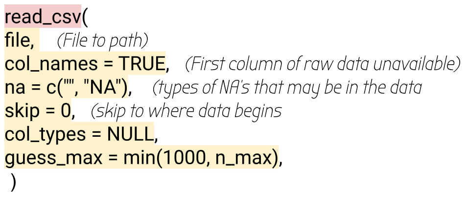

class: clear, title-slide, inverse, center, top, middle

```{r setup, include=FALSE}
knitr::opts_chunk$set(echo = FALSE)
```

```{r, echo=FALSE}
# then load all the relevant packages
pacman::p_load(pacman, knitr)
```

```{r xaringan-panelset, echo=FALSE}
xaringanExtra::use_panelset()
```

```{r xaringanExtra-clipboard, echo=FALSE}
# these allow any code snippets to be copied to the clipboard so they 
# can be pasted easily
htmltools::tagList(
  xaringanExtra::use_clipboard(
    button_text = "<i class=\"fa fa-clipboard\"></i>",
    success_text = "<i class=\"fa fa-check\" style=\"color: #90BE6D\"></i>",
  ),
  rmarkdown::html_dependency_font_awesome()
)
```
```{r xaringan-extras, echo=FALSE}
xaringanExtra::use_tile_view()

```

# `r rmarkdown::metadata$title`
----
### `r rmarkdown::metadata$author`
### `r format(Sys.time(), "%B %d, %Y")`

---
# Recap from Reproducible Research

- Well Documented
- Clear Communication
- Reproducible Research Theory

---


class: clear, laser

.quote[Consider what “knowledge” looks like within the analytic approach being developed asking, *What are we trying to measure?*]

.author[~ Knight & Shum, 2017, p. 19]

---
# Agenda

.pull-left[**Part-1  Conceptual Overview**
- Types of Data Used in LA (Sources)
- Characteristics of Data (Format)

]

.pull-right[**Part-2  Code-Along**
- Read in Data
- view Data

]


---
# Types of Data Used in LA (Sources)

.panelset[

.panel[.panel-name[Types]


.center[

]
]

???
Although we are going to talk about these types of data in silo, in practice researchers find value in using them together.
In the following presentation we will introduce a workflow outlining ways which  data  from  multiple  sources  can  be  analyzed, interpreted, and  translated into change.


The types of data show:
- Indicators of a school's success and progress.
- Student progress, student behavior, and student learning.
- Demographic or social media sources.


]

---
# Digital Learning Environments

.panelset[

.panel[.panel-name[DLE]

Digital learning environments include any set
of technology-based methods that can be applied to support learning and instruction. Ifenthaler(2017).

.pull-right[

]
]
???

According to Krumm et al, Digital Learning Environments have fueled data intensive research in education more than any other data.

.panel[.panel-name[Games+]

.pull-left[Games and Simulations:
- Captures real-time interactions
- Cognitive outcomes
- Behavior outcomes
- Affective outcomes

]

.pull-right[

]
]
???
- Early, iterative user-testing
- help surface basic player interactions for improved core mechanics
- UI/UX and learning design
- Structure discovery and relationship mining

.panel[.panel-name[ITS]

Intelligent Tutoring Systems 
.pull-left[Three types: 
1. An expert, or domain model
2. A student model
3. An instructional, or pedagogical model

]

.pull-right[

]
]
???
Intelligent Tutoring Systems is a type of DLE that applies AI to students interactions in the digital system.

- has three models, an expert, or domain model, which organizes the skills and strategies in the domain, 
a student model of what a student understands about the domain that is inferred from their performances on learning tasks and,
an instructional (pedagogical model) that includes  common mistakes and misconceptions along with a corresponding feedback strategy 


- The same data that the ITS uses to figure out how to respond to a student’s actions can also be used by human analysts to gain a detailed picture of learning processes and the behaviors learners engage in.

.panel[.panel-name[LMS]
Learning Management Systems
.pull-left[
- Free/freemium courses, certificates, PD
- Edx
- Coursera
- Friday Institute
- Collect granular data like ITS
]

.pull-right[

]
]
???
A Learning Management System (LMS) is an online integrated software used for creating, delivering, tracking, and reporting educational courses and outcomes. Often used as student-facing repositories of digital resources and activities,


We use Moodle at NCSU. What LMS do you use at your institution?

.panel[.panel-name[MOOCs]
.pull-left[
- Free/freemium courses, certificates, PD
- Edx
- Coursera
- Friday Institute
- Collect granular data like ITS
]

.pull-right[

]
]
???
Raise your hand if you have ever participated in a MOOC? The FI has many free MOOCs available, but there are also EDx and Coursera that you can take a MOOC at. These offer a major source for data from the large numbers of participants.

]


---
# Administrative Data

.panelset[

.panel[.panel-name[A.D.]

Types of State and Federal systems used in schools and districts to collect and store information to deliver some *sort* of service.

.pull-right[

]
]
???
Administrative Data is the second type of data fueling data intensive research.
Used in Schools, at district level and throughout most states.

.panel[.panel-name[SIS]

.pull-left[
- Student level - Academic Performance
- Teacher & Administrator facing repository
- Technology-based intervention

]

.pull-right[

]
]
???
**Student information systems**
Can be at the Student level or Teacher and Administrator level of student demographic and learning-outcome data.

- A ready source of data on educational outcomes (e.g., grades) and demographic information, which can play a role in evaluations of technology-based interventions as well as early warning system research 


.panel[.panel-name[SLDS]

.pull-left[
- Connects state-wide
- Accountability and reporting

]

.pull-right[

]
]
???
**statewide longitudinal data systems**
- standardized test performances, attendance, and major behavioral infractions.
- unique statewide identifier for every student
- Ability to link state K12 with HEd system; storage of each student’s demographic characteristics and enrollment history and scores on state accountability tests
- Data infrastructure to examine “educational outcomes at the scale of an entire state” p.34

State  level  and  university-based  researchers  increasingly  leveraged  these  data  for  both  accountability  and  reporting  purposes  as  well  as  district-and  school-improvement purposes.


]

---
# Sensors and Multimodal

.panelset[

.panel[.panel-name[Sensors+]

Location, physical movement and speech data.

.pull-right[

]
]
???
How many of you have an apple watch, or a fitbit or Samsung? These watches measure different things surrounding our health and fitness. The data can then be used to explain or predict our **health**

.panel[.panel-name[Research]

.pull-left[
- capture biometric data
- parse audio and video recordings using machine learning and artificial intelligence techniques
- Fitness devices
- Multimodal investigation
]

.pull-right[

]

]
???

identifying multiple affective and engagement-related states
detect facial expressions(audio, video)
speech recognition
speech prosody

- Understanding  what  learners  do  as  they  engage  in  learning  tasks  can  drive  digital  learning  environment adaptations.


]
---
# Characteristics of Data

.panelset[

.panel[.panel-name[Types]


.center[

]
]

???

In data-intensive research we might acquire data from LMS, SIS or another source. Data maybe to big for a typical  database  software  tools  to  capture,  store,  manage,  and  analyze”

Those data are similar but different because 
1. the tasks that students are engaged in and 
2. how data from those tasks are collected and stored by the technology. 


.panel[.panel-name[Structured]

```{r round-block, echo=FALSE, warning=FALSE, message=FALSE}
#show first 5 rows
library(tidyverse)
sci_course <- read_csv("data/sci-online-classes.csv")
sci_course%>%
  head(n=5)
```

]
???
Types: Quantitative in nature
Here we see the rows and columns nice and tidy. 
- data is tidy when each column is a variable, each row is an observation, and each cell is a single value.

We typically have tidy data in Excel files or SQL databases that we can import using the readr function or here function.

- Tabular - relational data. 
Examples might include:
- performance data (current and prior)
- demographic data (student’s ethnic and or group or disability)

Each field (variable) is discrete and can be accessed separately or jointly along with data from other fields (variables).

.panel[.panel-name[Unstructured]

.center[

]
]
???
Types: Qualitative in nature
Non-Relational Data
sensor data, web logs, clickstreams, keystroke capture data, emails, images and videos

Text Heavy relationships between nodes
IE: Audio, video, dates SQL database

.panel[.panel-name[Semi-Structured]

.center[

```{r sna_plot, message=FALSE, echo=FALSE, warning=FALSE}
library(igraph)
ties <- read_csv("data/dlt1-edgelist.csv", 
                 col_types = cols(Sender = col_character(),
                                  Receiver = col_character(), 
                                  `Category Text` = col_skip(), 
                                  `Comment ID` = col_character(), 
                                  `Discussion ID` = col_character()))
actors <- read_csv("data/dlt1-nodes.csv", 
                   col_types = cols(UID = col_character(), 
                                    Facilitator = col_character(), 
                                    expert = col_character(), 
                                    connect = col_character()))
network <- graph_from_data_frame(d = ties, 
                                 vertices = actors, 
                                 directed = T) 
E(network)$weight <- 1 
weighted_network <- simplify(network,
                             edge.attr.comb = list(weight="sum")
                             )
node_degree <- degree(weighted_network, mode = "all")
plot(weighted_network,
     vertex.label = NA,
     vertex.size = node_degree*.1,
     edge.arrow.size = .04)
```


]
]
???

Types - Qualitative data
Triangular Data (uses surveys and interview answers)
Semi-structured data is a form of structured data that does not conform with the formal structure of data models associated with relational databases or other forms of data tables.

self-describing structure
contain tags
IE: Social media, JSON and XML, Social Network

.panel[.panel-name[Meta-Data]

.center[

]

]
???
Not in the readings but something to think about is Meta-data collection, such as the field dates, times and locations of photos, videos and other structured data about data.
 - contexts and purposes for why the data was collected
 
You can read more about the meta data standards on Canada's heritage information network. https://www.canada.ca/en/heritage-information-network/services/collections-documentation-standards/chin-guide-museum-standards/metadata-data-structure.html


]

---

class: clear, inverse, middle, center

Part 2:

----

Code-Along

---
# Set Working Directory

```{r eval = FALSE, echo=TRUE}
#sets your working directory
setwd("/path/to/my/directory")

# tells you what working directory your in
getwd()
```

???
Continuing on from foundation lab one we will use "good programming practices" to learn more about reading in data.

Again we are using a script file in R Studio. You will become familiar with R Markdown files in the next foundation lab. 

A default working directory is a folder where RStudio goes, every time you open it. You can change the default working directory from RStudio menu under: Tools –> Global options –> click on “Browse” to select the default working directory you want.

Although you can set your working directory in Session menu tool it is better to set it with code for reproducibility.

You can also create a project and connect to your github account. Then open up the project which also sets the directory.

---
# Read in Data
.panelset[

.panel[.panel-name[package]

```{r echo=TRUE}
# Load tidyverse package 
library(tidyverse)#<<

# could load only readr 
library(readr) #<<

```
]
???

In order to read in data we must load packages that allow us to read data in, like we did in foundation lab 1. 

Although there are rad in capabilities with the utils package in base r, we are going to use a more modern approach.

One of the packages in Tidyverse allows for reading in Comma delimeter files, or CSV. 


*Reminder if needed - this was discussed in foundation 1*
R comes with several packages in base r when you start a session. Packages are a collection of objects, data sets around a theme or purpose. You may find a package whose objects are for the purpose of correlation, like in the cor package. Or you may find a package that has objects to produce better tables, like in the *kable extra* package. Or you may find a package that will help wrangling the data (processing it) easier than in Base R package. That is the package we are going to install here Tidyverse.

Tidyverse is a suite of packages that share a common philosophy and are designed to work together. Think Google products or Microsoft products. data importing, data wrangling and plotting.

.panel[.panel-name[functions]
Common readr functions



]
???

Common functions that are included when you read in data are 
1. the file, we need to give a path to get the data. It should be in the working directory.

2. column names corresponds to variables on the first row. The first row of the input will be used as the column names, and will not be included in the data frame. If FALSE, column names will be generated automatically: X1, X2, X3 etc.

3. NA corresponds to missing values. commonly you will see capital NA but you may also see quotations or only a period depending on the original database (excel, SAS, STATA etc).

4. Skip functions allows you to skill to when your data starts. 

5. col_types is not typically needed but good to know. R guesses what type of column types you have when it reads in the file using the default guess_max.
This is convenient (and fast), but not robust. If the imputation fails, you'll need to increase the guess_max or supply the correct types yourself.

6. guess_max if the imputation fails increase the number beyond the 1000 default to guess col_types correctly.

.panel[.panel-name[readr]
# Using the readr function

[readr](https://readr.tidyverse.org/)

.pull-left[
```{r echo = TRUE, message = FALSE, warning=FALSE}
online_classes <- read_csv("data/sci-online-classes.csv")

head(online_classes, n=5)

```
]

.pull-right[

]
]
???
readr is a quick way to read in comma-separated values (CSV) and tab-separated values (TSV)

- show also how to click on the file and import data or copy the location


.panel[.panel-name[readxl]
# read in excel files
```{r echo=TRUE, warning=FALSE, message=FALSE}
library(readxl) #<<
csss_tweets <- read_excel("data/csss_tweets.xlsx")
head(csss_tweets, n = 5)
```
]

???


.panel[.panel-name[functions]

]

]
---


class: inverse, clear, center

## .font130[.center[**Thank you!**]]

.left-col[
.center[<br/>**First Author**<br/><mailto:author1@email.com>]
]
.center-col[
.center[<br/>**Second Author**<br/><mailto:author2@email.com>]
]
.right-col[
.center[<br/>**Third Author**<br/><mailto:author3@email.com>]
]
<br/><br/><br/><br/><br/>

.pull-left-narrow[<br/>.center[ ]]

.pull-right-wide[
.left[.font70[
This work was supported by countless cups of hot tea, cookies, and the RStats Xaringan community willingness to post of plethora of tutorials. But you may wish to thank your funding agency (e.g., the National Science Foundation) and put their logo on the left as shown here.
]]
]
